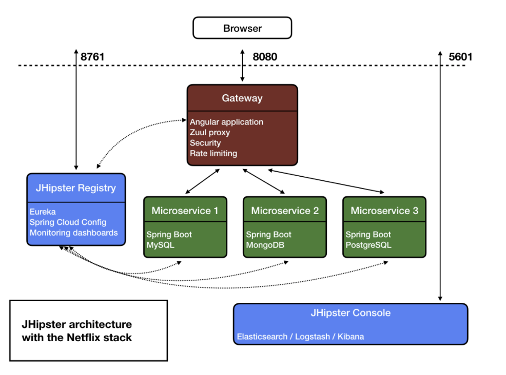

## Branch Rules

microservice name

 

## Commit message type

| Type        | Description                                       |
|:------------|:--------------------------------------------------|
| `feat`      | When create a new feature.                        |
| `fix`       | When fix a bug.                                   |
| `docs`      | When add or change documentation.                 |
| `style`     | When improve code style.                          |
| `refactor`  | When improve code without add or change feature.  |
| `perf`      | When improve performance.                         |
| `test`      | When add or change test code.                     |
| `chore`     | When change build process or tool.                |
| `ci`        | When change CI configuration files and scripts.   |
| `revert`    | When revert a commit.                             |
| `misc`      | When something else entirely.                     |

<a href="https://github.com/jongwooo/gatsby-cache/blob/main/.github/CONTRIBUTING.md">**-> 자세히보기**</a>

 

